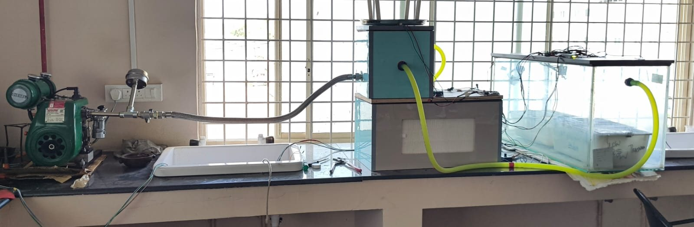
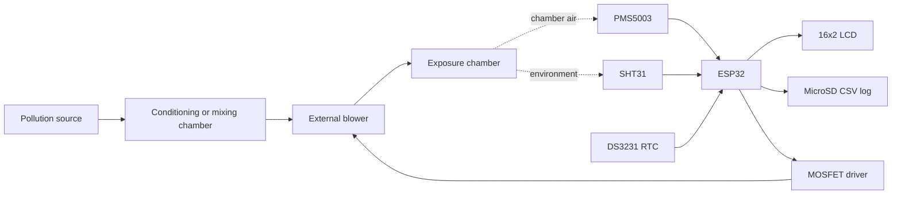
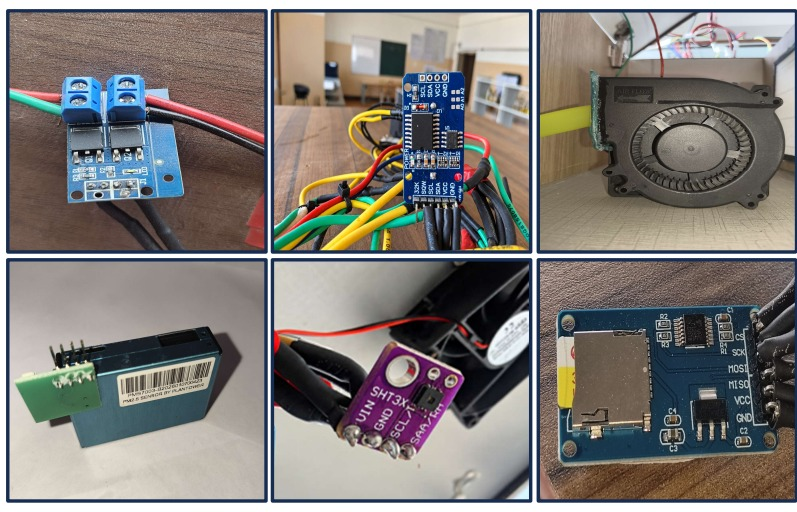
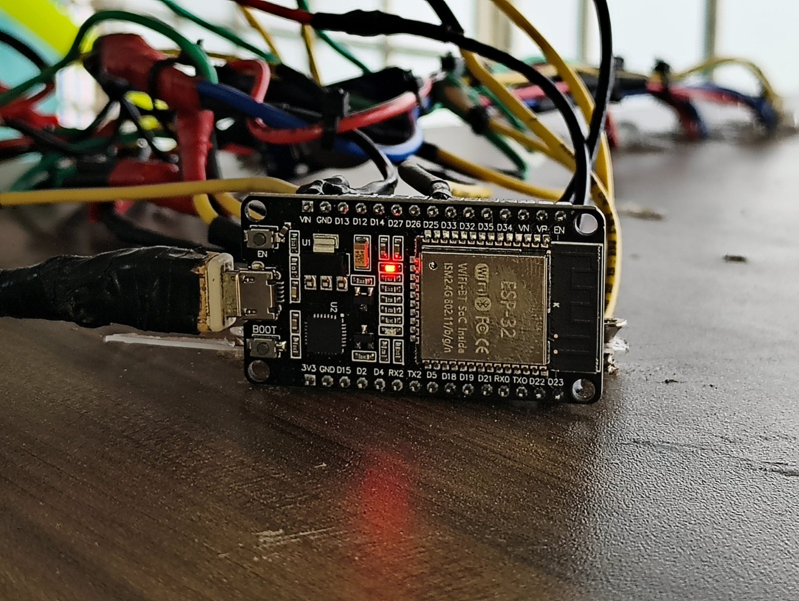
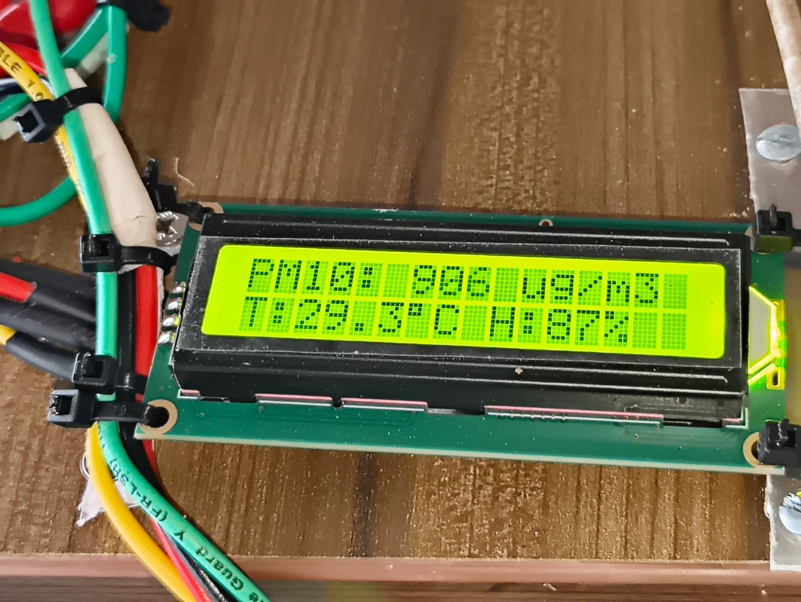
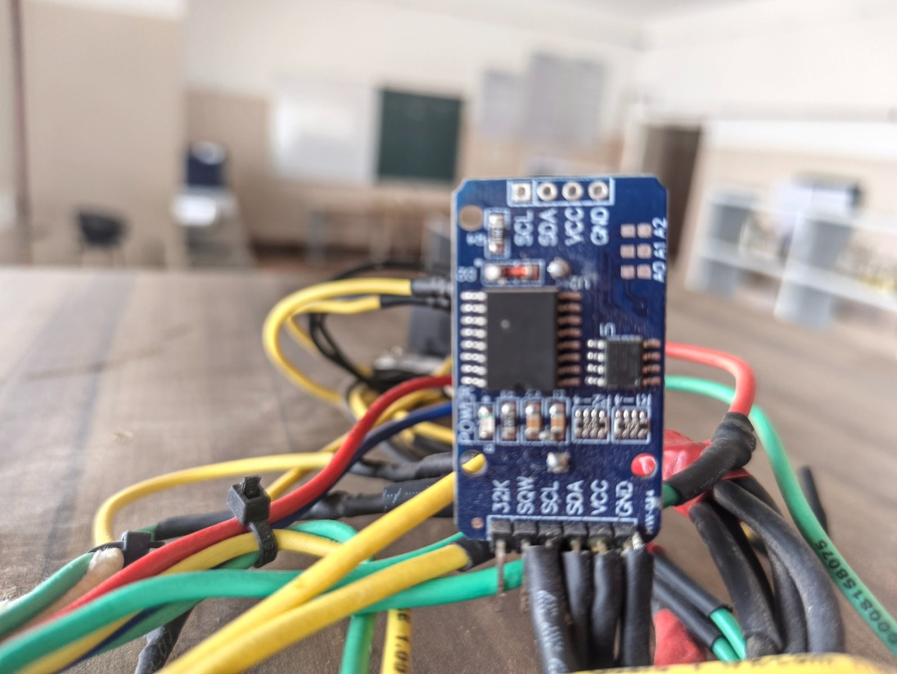
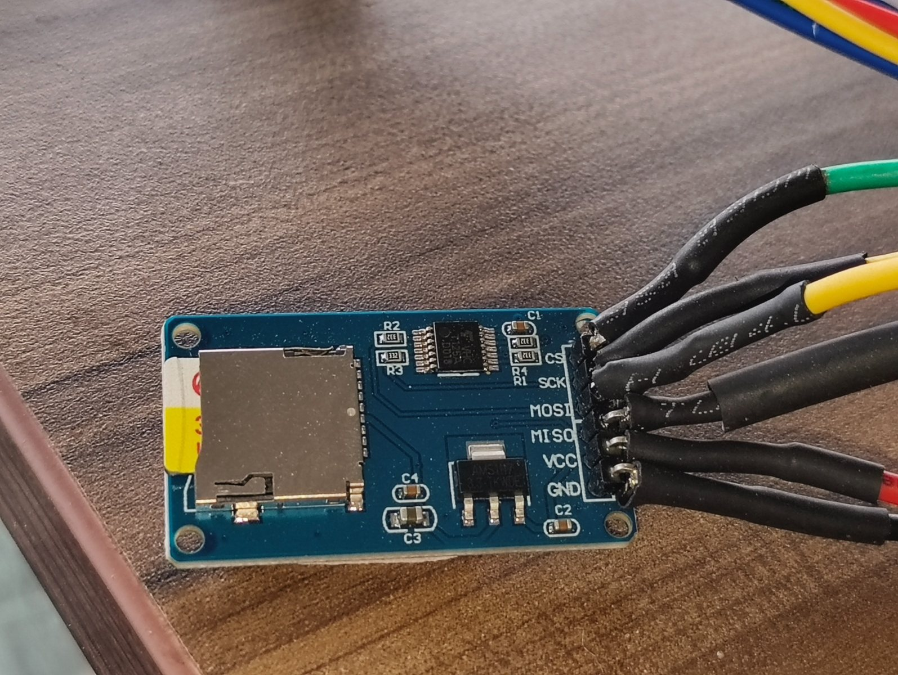

# ESP32 Urban Air Pollution Exposure Chamber Controller

An ESP32-based monitoring, airflow-control, and data-logging subsystem developed for an interdisciplinary M.Pharm project studying particulate-matter exposure. The system integrates particulate, temperature, and humidity sensing with timestamped SD-card logging, a local LCD, and PWM control of an external centrifugal blower.

   



> Portfolio scope: I engineered and integrated the electronics, wiring, chamber interconnections, blower-control hardware, safeguards, and embedded firmware. The collaborating M.Pharm researcher conducted the animal exposure work and biological testing. No biological results or claims are presented in this repository.

## My contribution

- Integrated the ESP32 with a PMS5003 particulate sensor, SHT31 temperature/humidity sensor, DS3231 real-time clock, 16x2 I2C LCD, and microSD module.
- Wired and configured the MOSFET-based PWM interface for the external centrifugal blower without powering the load from the ESP32.
- Connected the pollution-generation, conditioning, and exposure chambers through the airflow path used by the research prototype.
- Added common-ground, load-isolation, fuse, flyback/surge-protection, logic-level, and strain-relief considerations to the electrical design.
- Developed firmware to read PM1.0, PM2.5, PM10, temperature, and humidity; validate PMS frames by checksum; display the selected PM fraction; and record timestamped CSV data every two seconds.
- Implemented configurable PM2.5/PM10 operating modes and a defined sensor-fault response for the blower.
- Delivered the integrated prototype to the M.Pharm collaborator for experimental testing and biological analysis.

## System architecture



The blower-speed direction assumes the blower supplies particle-laden air to the exposure chamber: lower measured concentration commands more airflow and higher concentration commands less. If the blower is instead used for dilution or exhaust, the control direction and fault state must be reversed before operation.

## Hardware

| Component | Purpose |
|---|---|
| ESP32 development board | Main controller and data acquisition |
| PMS5003 particulate sensor | PM1.0, PM2.5, and PM10 measurement over UART |
| SHT31 sensor | Temperature and relative-humidity monitoring |
| DS3231 module | Date and time for each recorded sample |
| 16x2 I2C LCD | Local display of PM and environmental readings |
| MicroSD module | CSV data storage |
| MOSFET switching module | PWM interface between ESP32 and blower |
| Centrifugal blower | Controlled movement of air through the chamber system |
| External load supply | Powers the blower at its rated voltage/current |

## ESP32 connections

| Function | ESP32 pin | Connected module |
|---|---:|---|
| I2C SDA | GPIO 21 | LCD SDA, SHT31 SDA, DS3231 SDA |
| I2C SCL | GPIO 22 | LCD SCL, SHT31 SCL, DS3231 SCL |
| PMS UART input | GPIO 16 / RX2 | PMS5003 TX |
| Blower PWM control | GPIO 25 | MOSFET module control input |
| SPI SCK | GPIO 18 | MicroSD SCK |
| SPI MISO | GPIO 19 | MicroSD MISO |
| SPI MOSI | GPIO 23 | MicroSD MOSI |
| SD chip select | GPIO 5 | MicroSD CS |

See [docs/WIRING.md](docs/WIRING.md) for power, grounding, and protection notes. The wiring guide deliberately uses `V_BLOWER` because the exact supply must match the rating printed on the selected blower.

## Firmware behavior

The portfolio firmware in [`firmware/air_quality_controller/air_quality_controller.ino`](firmware/air_quality_controller/air_quality_controller.ino):

1. Initializes the UART, I2C, SPI, SD card, RTC, LCD, and PWM output.
2. Reads and checksum-validates a 32-byte PMS5003 frame.
3. Reads temperature and humidity without replacing failed readings with false zero values.
4. Selects PM2.5 or PM10 as the displayed/control variable through one configuration setting.
5. Applies the prototype's documented stepwise blower profile.
6. Moves the blower to a configured fault state when particulate data are invalid.
7. Writes date, time, operating mode, PM values, temperature, humidity, sensor status, and blower percentage to CSV every two seconds.

### Prototype blower profile

| Selected PM reading | Blower command |
|---:|---:|
| Below 500 µg/m³ | 100% |
| 500-675 µg/m³ | 60% |
| 676-699 µg/m³ | 40% |
| 700 µg/m³ or above | 20% |

These bands came from the supplied prototype program. They are not universal exposure limits or validated biological setpoints. They must be reviewed against the experimental protocol, airflow direction, chamber volume, and sensor calibration before reuse.

## Build requirements

- ESP32 board package for Arduino
- `LiquidCrystal_I2C`
- `Adafruit SHT31 Library`
- `RTClib`
- ESP32 `SD`, `SPI`, and `Wire` libraries

Set `ACTIVE_MODE` to `ExposureMode::PM25` or `ExposureMode::PM10` near the top of the firmware. Confirm `BLOWER_SUPPLIES_POLLUTED_AIR` matches the physical airflow arrangement before connecting the load.

## Example CSV schema

```text
Date,Time,Exposure_Mode,PM1.0_ug_m3,PM2.5_ug_m3,PM10_ug_m3,Temperature_C,Humidity_pct,PMS_Valid,Blower_Speed_pct
2026-01-15,10:30:02,PM2.5,342,518,601,29.3,73.0,1,60
```

The example demonstrates formatting only; it is not an experimental result.

## Repository structure

```text
urban-air-pollution-controller/
├── README.md
├── docs/
│   ├── WIRING.md
│   └── images/
└── firmware/
    └── air_quality_controller/
        └── air_quality_controller.ino
```

## Project status and limitations

- The original electronics were assembled and handed over as a working research prototype.
- The firmware in this repository is a documented portfolio refactor of the two supplied prototype programs; this refactor has not been independently re-tested on the original hardware.
- The original PM10 program displayed PM10 but still controlled the blower using PM2.5. The refactor makes the selected control variable explicit.
- Optical PM readings can be affected by humidity and aerosol composition. Chamber measurements require calibration and validation against the research method.
- This repository does not contain animal data, biomarker results, histopathology, or claims about CYP1A2 effects.
- Operation in an animal study requires approval and supervision under the institution's applicable ethics and laboratory-safety procedures.

## Prototype photographs

### Electronics and sensors



### ESP32 controller



### Live LCD reading



### Timing and storage modules

| DS3231 real-time clock | MicroSD data logger |
|---|---|
|  |  |


