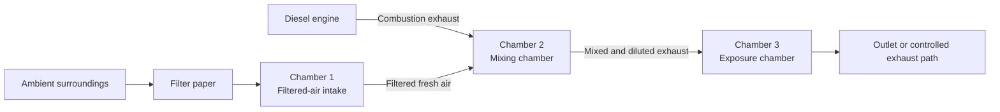
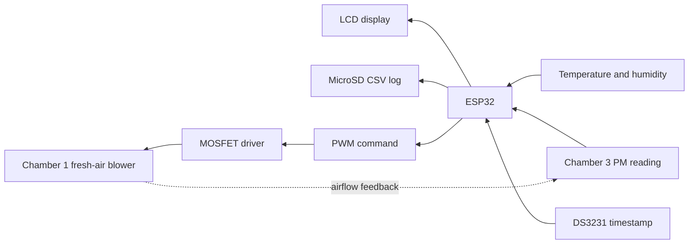

# Three Chamber System Architecture

## Purpose

The prototype creates a controlled particulate-exposure stream by combining diesel-engine exhaust with filtered ambient air. The mixed stream is delivered to a third chamber, where particulate concentration, temperature, and humidity are measured and logged.

## Airflow path

### Chamber 1 filtered-air stage

Chamber 1 receives air from the surrounding environment through filter paper. Its airflow path provides filtered fresh air to Chamber 2. The external fan or centrifugal blower is driven through a MOSFET using an ESP32 PWM signal.

### Chamber 2 mixing stage

Chamber 2 has three principal airflow ports:

1. Diesel-engine exhaust inlet.
2. Filtered-air inlet from Chamber 1.
3. Mixed-stream outlet to Chamber 3.

The incoming combustion exhaust and filtered air are mixed before transfer to the exposure chamber. Fans/blowers support circulation and movement through this stage.

### Chamber 3 exposure and measurement stage

The mixed stream enters Chamber 3, which is used by the collaborating M.Pharm researcher for the approved exposure procedure. Instrumentation associated with this stage includes:

- PMS5003 for PM1.0, PM2.5, and PM10 mass-concentration readings.
- SHT31 for temperature and relative humidity.
- ESP32 for acquisition and control processing.
- 16x2 LCD for live values.
- DS3231 real-time clock for timestamps.
- MicroSD module for CSV data logging.

## Control and data flow

The firmware samples the chamber every two seconds. A checksum-validated PMS frame supplies the particulate readings, while the SHT31 supplies environmental conditions. The ESP32 selects PM2.5 or PM10 as the configured control/display variable, applies the stepwise PWM profile, updates the LCD, and appends the complete record to the SD card.

## Measurement boundary

The installed PMS5003 measures particulate mass concentration; it does not directly measure toxicity or identify the chemical composition of the exhaust. The SHT31 measures only temperature and relative humidity. Diesel-exhaust gases such as carbon monoxide, carbon dioxide, and nitrogen oxides are outside the measurement capability of the documented prototype and would require separate sensors and validation.

The displayed thresholds are prototype configuration values rather than universal exposure or safety limits. Any reuse requires verification of chamber airflow, PWM polarity, sensor calibration, study requirements, and the applicable laboratory and ethics approvals.

